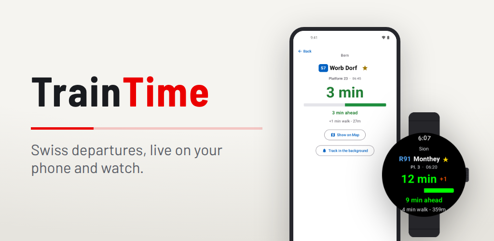
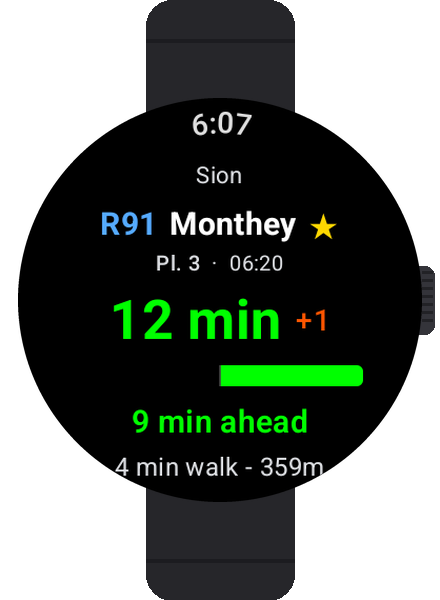

<p align="center">
  
</p>

<h1 align="center">TrainTime</h1>

<p align="center">
  Swiss public transport departures on your wrist.<br />
  Walk times, delays, platforms - glance and go.
</p>

<p align="center">
  <a href="https://apps.apple.com/ch/app/traintime/id6760388620"></a>&nbsp;
  <a href="https://play.google.com/store/apps/details?id=com.evanjt.traintime"></a>&nbsp;
  <a href="https://apps.garmin.com/apps/c70bbfae-846a-4d00-9e96-d485217035fb"></a>
</p>

<p align="center">
  <a href="https://traintime.ch/privacy">Privacy</a>&nbsp;&nbsp;·&nbsp;&nbsp;<a href="https://traintime.ch">Website</a>
</p>

---

<p align="center">
  
</p>

<p align="center">
  &nbsp;&nbsp;
  &nbsp;&nbsp;
  &nbsp;&nbsp;
  
</p>

---

## Features

- **Nearby stations** - GPS-based discovery with live walk time and distance
- **Live departures** - Platform numbers, destinations, real-time delays
- **Focused tracking** - Tap a departure to track it with a live countdown
- **Train, bus, tram & more** - Switch between transport modes including boats, funiculars, and cable cars
- **Favourites & pinned stations** - Star a connection and it rides above the gold line on every device
- **Phone to watch handoff** - Send a tracked departure from the phone straight to your wrist

## Platforms

| Platform | Status |
|----------|--------|
| [Apple Watch & iPhone](https://apps.apple.com/ch/app/traintime/id6760388620) | Available |
| [Wear OS & Android](https://play.google.com/store/apps/details?id=com.evanjt.traintime) | Available |
| [Garmin](https://apps.garmin.com/apps/c70bbfae-846a-4d00-9e96-d485217035fb) | Available |

## Feature parity

TrainTime runs on five targets across three ecosystems. The core experience is
the same everywhere. The differences are platform idioms, not missing features.

| Feature | iPhone | Apple Watch | Android | Wear OS | Garmin |
|---|:---:|:---:|:---:|:---:|:---:|
| Nearby stations (GPS) | ✓ | ✓ | ✓ | ✓ | ✓ |
| Live delays & platforms | ✓ | ✓ | ✓ | ✓ | ✓ |
| Focused tracking + countdown | ✓ | ✓ | ✓ | ✓ | ✓ |
| Train formation diagram | ✓ | ✓ | ✓ | ✓ | ✓ |
| Train, bus, tram & more | ✓ | ✓ | ✓ | ✓ | ✓ |
| Favourites | ✓ | ✓ | ✓ | ✓ | ✓ |
| Pinned stations | ✓ | ✓ | ✓ | ✓ | ✓ |
| Home-screen widget / glance | ✓ | — | ✓ | — | ✓ |
| Onboarding walkthrough | ✓ | — | ✓ | — | — |
| Map | ✓ | ✓ | ↗ | — | ↗ |

✓ available &nbsp;·&nbsp; — not on this platform &nbsp;·&nbsp; ↗ opens the system maps or navigation app

Each watch pairs with a phone and stays in sync: Apple Watch with iPhone,
Wear OS with Android, Garmin with either. A departure you track on the phone
can be sent straight to the watch, and the watch reports its liveness back.
The phones add saved SBB routes with departure reminders and an in-app
light/dark theme. The Apple Watch and Wear OS can view and follow a route
queued on the phone.

## Build

### Apple Watch

Open `apple/TrainTimeWatch.xcodeproj` in Xcode.

### Android & Wear OS

```bash
cd android
./gradlew assembleDebug
```

### Garmin

```bash
cd garmin
./setup.sh           # Install Connect IQ SDK
./build.sh           # Build for fenix6pro (default)
./build.sh release   # Build .iq package for all devices
```

## API

Uses a self-hosted worker API backed by [Open Transport Data Switzerland](https://opentransportdata.swiss). Source: [traintime-api](https://github.com/evanjt/traintime-api). Copy `Secrets.swift.example` / `Secrets.mc.example` to `Secrets.swift` / `Secrets.mc` and fill in your API key.

## License

&copy; 2026 Evan Thomas
