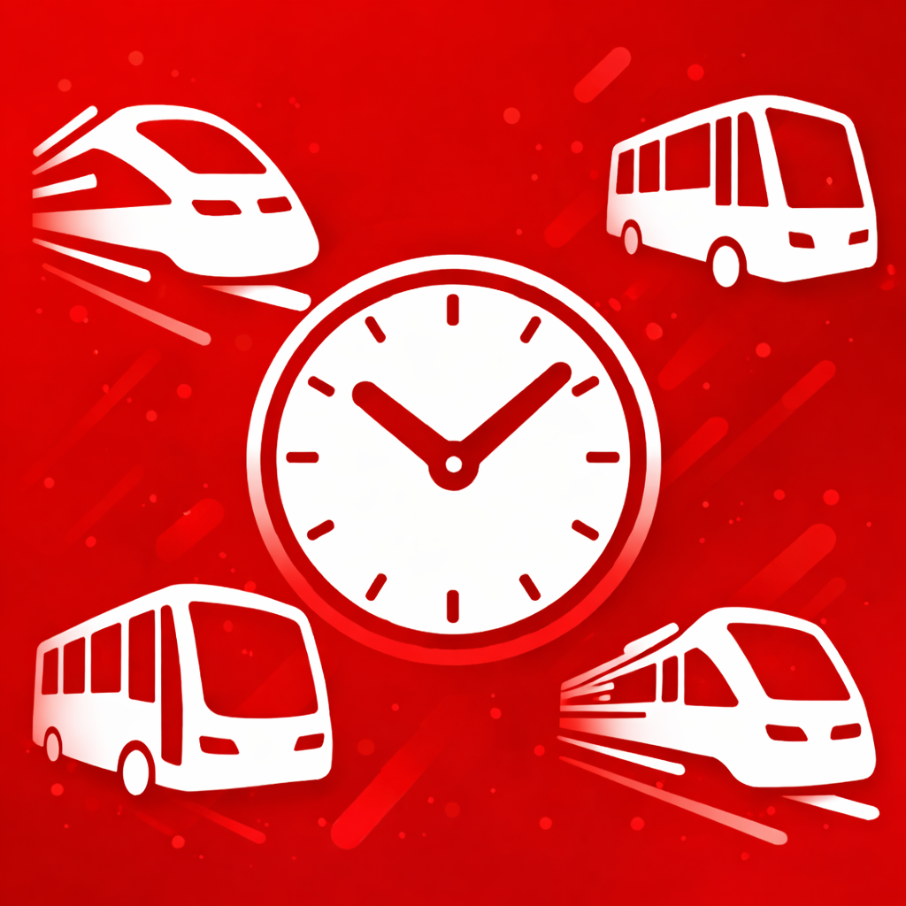
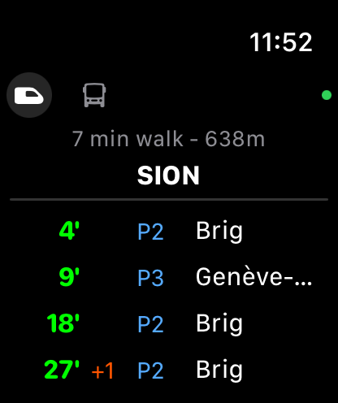
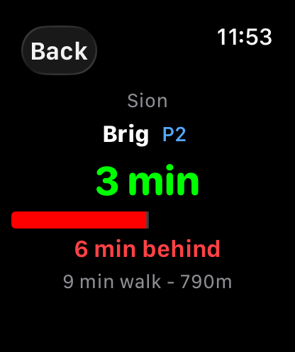
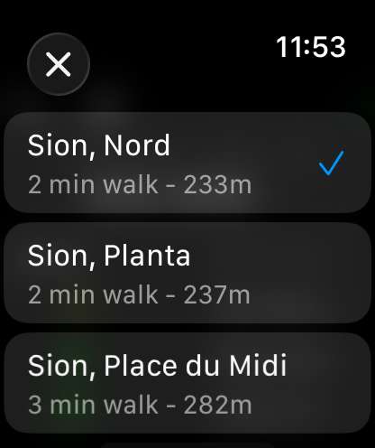

<p align="center">
  
</p>

<h1 align="center">TrainTime</h1>

<p align="center">
  Swiss public transport departures on your wrist.<br />
  Walk times, delays, platforms — glance and go.
</p>

<p align="center">
  <a href="https://traintime.evanjt.com/privacy">Privacy</a>&nbsp;&nbsp;·&nbsp;&nbsp;<a href="https://traintime.evanjt.com">Website</a>
</p>

---

<p align="center">
  &nbsp;&nbsp;
  &nbsp;&nbsp;
  
</p>

---

## Features

- **Nearby stations** - GPS-based discovery with live walk time and distance
- **Live departures** - Platform numbers, destinations, real-time delays
- **Focused tracking** - Tap a departure to track it with a live countdown
- **Train, bus, tram** - Switch between transport modes

## Platforms

| Platform | Status |
|----------|--------|
| Apple Watch | Available |
| Garmin | Coming soon |

## Build

### Apple Watch

Open `apple-watch/TrainTimeWatch.xcodeproj` in Xcode.

### Garmin

```bash
cd garmin
./setup.sh           # Install Connect IQ SDK
./build.sh           # Build for fenix6pro (default)
./build.sh release   # Build .iq package for all devices
```

## API

Uses the [Swiss public transport API](https://transport.opendata.ch) (open data, no key required).

## License

&copy; 2026 Evan Thomas
