<p align="center">
  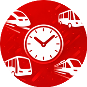
</p>

<h1 align="center">TrainTime</h1>

<p align="center">
  Swiss public transport departures on your wrist.<br />
  Walk times, delays, platforms - glance and go.
</p>

<p align="center">
  <a href="https://apps.apple.com/ch/app/traintime/id6760388620"></a>&nbsp;
  <a href="https://apps.garmin.com/apps/c70bbfae-846a-4d00-9e96-d485217035fb">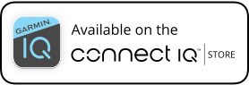</a>
</p>

<p align="center">
  <a href="https://traintime.ch/privacy">Privacy</a>&nbsp;&nbsp;·&nbsp;&nbsp;<a href="https://traintime.ch">Website</a>
</p>

---

<p align="center">
  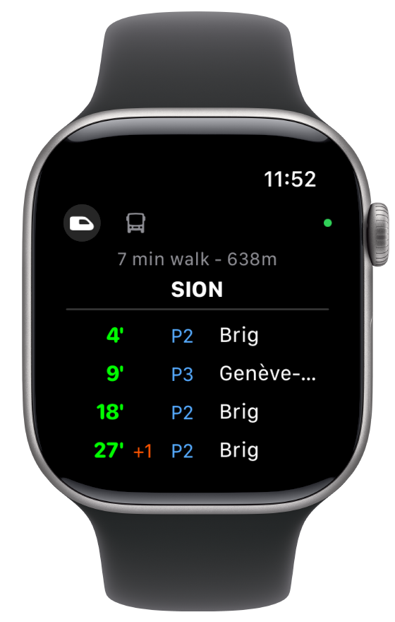&nbsp;&nbsp;
  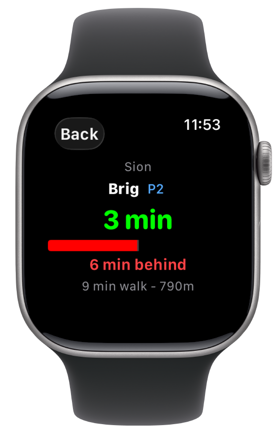&nbsp;&nbsp;
  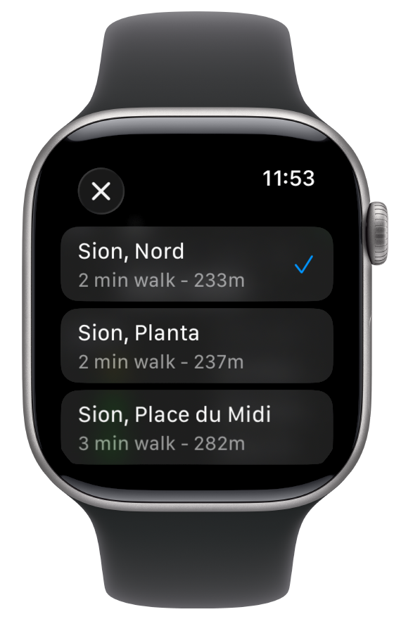
</p>

<p align="center">
  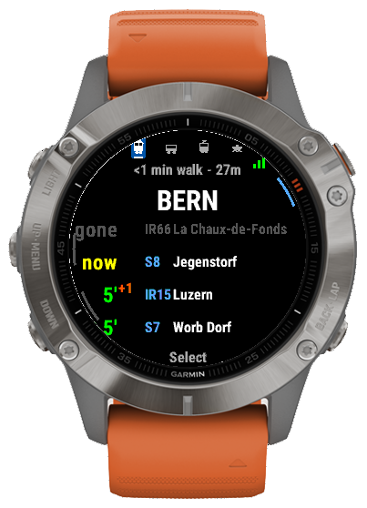&nbsp;&nbsp;
  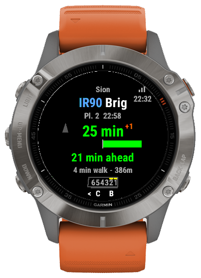&nbsp;&nbsp;
  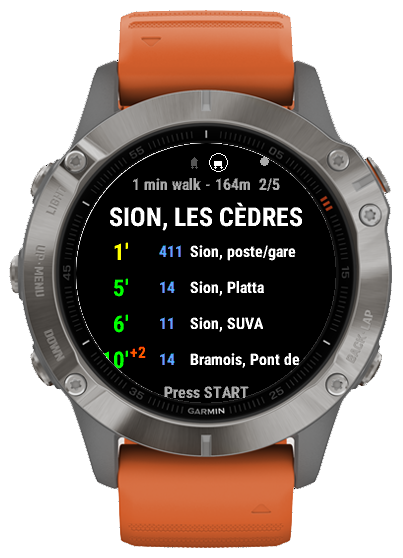
</p>

<p align="center">
  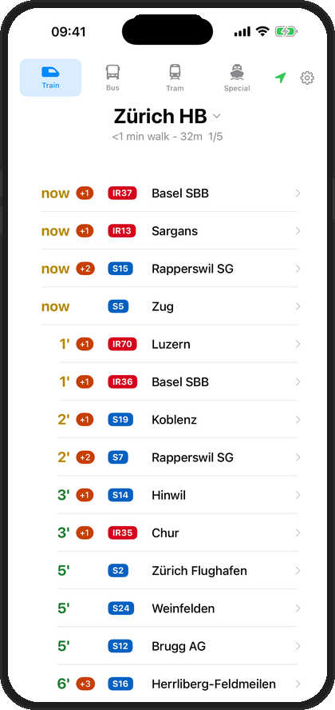&nbsp;&nbsp;
  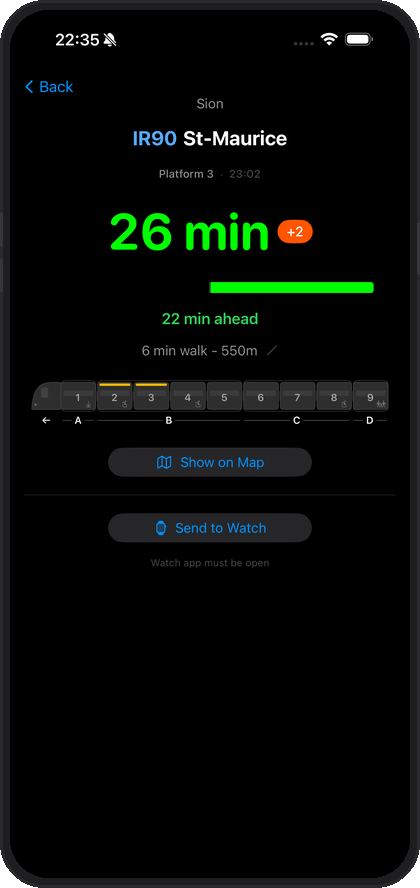&nbsp;&nbsp;
  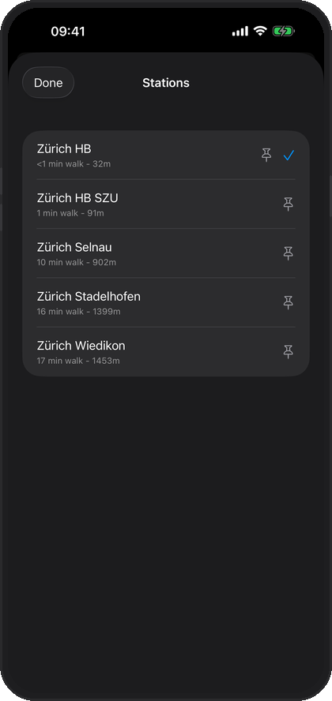
</p>

---

## Features

- **Nearby stations** - GPS-based discovery with live walk time and distance
- **Live departures** - Platform numbers, destinations, real-time delays
- **Focused tracking** - Tap a departure to track it with a live countdown
- **Train, bus, tram & more** - Switch between transport modes including boats, funiculars, and cable cars

## Platforms

| Platform | Status |
|----------|--------|
| [Apple Watch & iPhone](https://apps.apple.com/ch/app/traintime/id6760388620) | Available |
| [Garmin](https://apps.garmin.com/apps/c70bbfae-846a-4d00-9e96-d485217035fb) | Available |

## Build

### Apple Watch

Open `apple/TrainTimeWatch.xcodeproj` in Xcode.

### Garmin

```bash
cd garmin
./setup.sh           # Install Connect IQ SDK
./build.sh           # Build for fenix6pro (default)
./build.sh release   # Build .iq package for all devices
```

## API

Uses a self-hosted worker API backed by [Open Transport Data Switzerland](https://opentransportdata.swiss). Source: [traintime-api](https://github.com/evanjt/traintime-api). Copy `Secrets.swift.example` / `Secrets.mc.example` to `Secrets.swift` / `Secrets.mc` and fill in your API key.

## License

&copy; 2026 Evan Thomas
